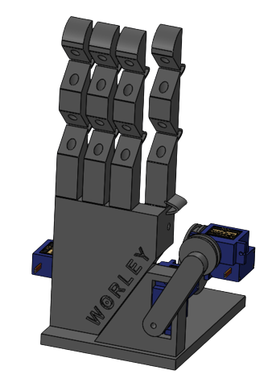

# Wireless Online Real-time Language Expression Yielder (WORLEY)

  

## Authors
- Anish Goyal [@anishgoyal1108](https://github.com/anishgoyal1108)
- Yubo Cao [@Yubo-Cao](https://github.com/Yubo-Cao)
- Ian Oberbeck

## Overview
We created a robot hand that can finger spell American Sign Language (ASL) in real time using spoken input from an app. 

Read [our poster](poster/Poster.pdf) for more information!

## Key Features
- **ASL translation**: WORLEY uses speech recognition technology and neural networks to translate spoken English into ASL gloss
- **Real-time signing**: The robot hand physically "acts out" ASL by manipulating fingers via servo motors, designed for realistic movements using compliant hinges and pull strings
- **Cost-effective**: The project was built with affordable materials, including a Raspberry Pi, servos, and 3D-printed components

## Methodology
WORLEY leverages a client-server architecture with WebRTC for communication. When a user speaks into the app, the server runs a lightweight Voice Activation Detection (VAD) system to identify speech. The detected speech is buffered into a queue with timestamps, and a 2-pointer technique is used to extract the longest continuous subsequence of spoken words. This subsequence is then processed through the Whisper Speech Recognition (WSPSR) system to obtain a transcript. The resulting transcript is fed into a custom-built transformer model, designed to translate English into ASL gloss—a simplified form of ASL where redundant words and grammar are omitted. The final translation is then wirelessly transmitted to the client, which communicates with the servo motors to control the signage of the robot hand.

## Novel Approach?
ASL is considered a completely separate language than English because it has its own rules, syntax, and abstractions, stripping away all unnecessary articles, prepositions, and conjugations to focus on the essential meaning of a sentence (e.g., "Bob crossed the street" becomes "BOB CROSS STREET"). WORLEY translates spoken English sentences into ASL gloss before performing any finger spellings by using state-of-the-art neural networks called transformers, which are particularly well-suited for data involving many-to-many relationships. **We are the first to accomplish this.** Additionally, many robot hands have been designed in science fairs for the purpose of finger spelling, but we only found one that was capable of spelling words in real time, and even then, it operates using text, not spoken, input.

## System Architecture
1. **Speech Input**: A user speaks into the WORLEY application, which captures audio
2. **WebRTC Connection**: The audio is streamed to a server via a WebRTC connection
3. **Speech Detection & Recognition**: A voice activation detection (VAD) model processes the audio, extracts relevant speech, and uses the Whisper model for recognition
4. **ASL Translation**: The recognized text is translated into ASL using a transformer model
5. **Robotic Hand Control**: The ASL translation is sent to a Raspberry Pi, which controls the robotic hand's movements via GPIO

## Challenges
- 3D printing issues and a significant delay on shipping for high-quality polypropelene led to structural defects that caused long-term tearing
- The design required a high Bore tolerance for accurate finger movements, which were not present in the SG90 servo motors
- Finger spelling had notable latency, especially for fast-paced conversations

## Materials
- SG90 servo motors
- Servo horns and screws
- 3D printed fingers and palm
- Jumper wires
- Polypropylene and polylactic acid filaments
- Raspberry Pi 4B

## Future Improvements
- **Speaker Diarization**: Enable the system to distinguish between multiple speakers
- **Model Deployment**: Improve real-time processing by separating model deployment from the HTTP server
- **Realism Enhancements**: Adding ball joints and silicone layers for more realistic hand movements
- **Wire Management**: Streamline the design by hiding servos and running wires internally

## Acknowledgements
Remarkably, WORLEY came to life in just two weeks and a $150 budget. We would like to thank the Georgia Governor's Honors Program and Georgia Southern University for giving us the opportunity to work on this project and allowing us to present our work at a research symposium.

Additionally, we would like to thank our program instructors, Anupam Goli, Craig Worley, Kai Ouyang, and DeJah Crossfield for their mentorship.
